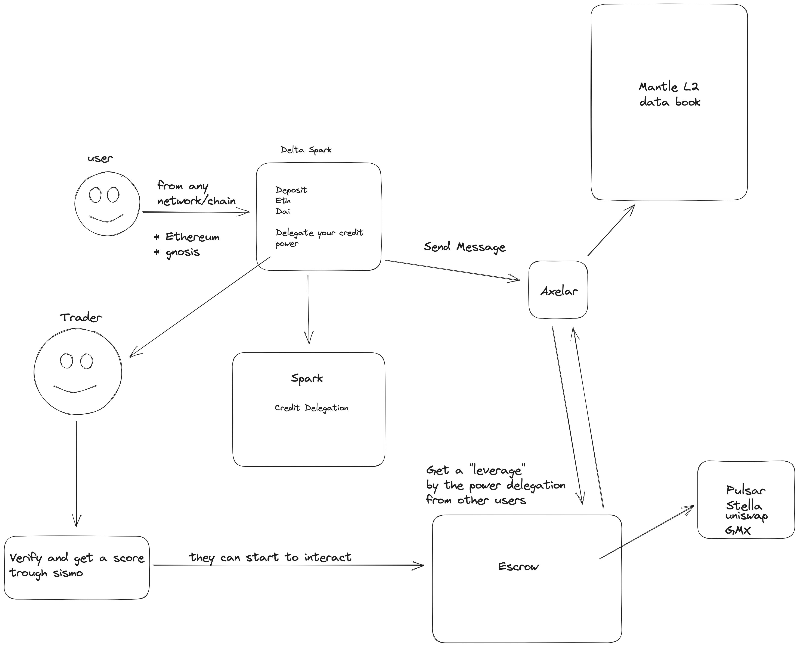

# SparkDeltaPrime

Optimizes user liquidity by placing, leveraging capital managers through zk proofs, generating efficient and sustainable returns.

## Use Case

* USER WITH LIQUIDITY BUT NO TIME
  ** The user who doesn't have time for farming but does have liquidity, has the option of staking, and the power to delegate liquidity.

* TRADER/CAPITAL MANAGER
  ** In the use case of the trader, it operates from **Mantle**. Sismo's technology allows the trader to enjoy a reputation with a higher score, leveraging is possible, as well as collateral-free loans. It's also possible to make movements across multiple chains without bridges.

### Diagram Flow

We are using **Spark** with the sparkLend service to permmit our users deposit his liquidity and delegato to our validated traders, our contracts deposits the liquidity from our users to the **Spark Protocol**, and activate the credit delegation feature, this helps to the best traders in our platform get leverage and execute positions without necessity to pass his liquidity trought a bridge this because we are implementing **Axelar GMP** to send messages between Mantle,Gnosis, Ethereum, etc.

